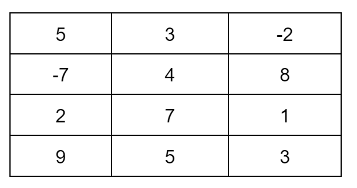
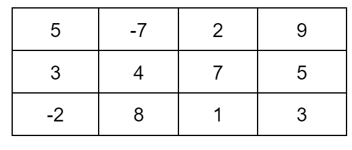

Zadanie dodatkowe Transponowanie macierzy
Zadania dodatkowe
To zadanie ma charakter dodatkowy, dlatego nie musisz wysyłać go swojemu Mentorowi.

Macierze matematyczne można przełożyć na język programistyczny jako tablicę tablic (tablicę dwuwymiarową). Na przykład macierz widoczna na grafice poniżej

w programie byłaby tablicą o wymiarach 3 x 4 (3 kolumny, 4 rzędy).

Transponowanie macierzy to proces, w którym zamieniamy wiersze na kolumny, a kolumny na wiersze. Macierz transponowana dla naszej macierzy wyglądałaby zatem następująco:

W programie byłaby to tablica o wymiarach 4 x 3 (4 kolumny, 3 rzędy).

Napisz program, który dokona transpozycji macierzy (tablicy dwuwymiarowej). Kluczowy algorytm zamknij w osobnej funkcji, która przyjmuje tablicę dwuwymiarową jako argument wejściowy oraz zwróci wynik transpozycji.